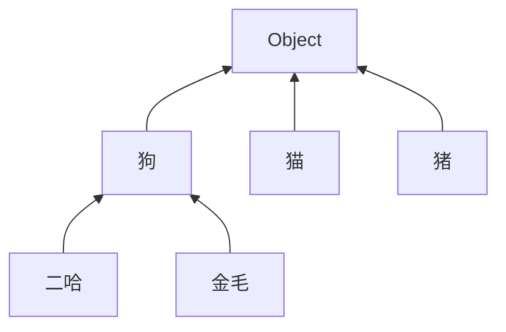

# YOLO v2 v3

今天由我来为大家介绍 YOLO 算法的改进，YOLO v2 和 YOLO v3。今天的报告分为三个部分，YOLO v2 , YOLO 9000, YOLO v3。v2是对v1的改进，YOLO9000是作者利用v2训练的一个可以识别出9000种物体的模型，v3是对v1v2的改进。

[TOC]

## YOLO v1

先简单回顾一下 v1，传统的目标检测算法先通过SS算法或者神经网络找出预测框，之后将框分类。YOLO另辟蹊径，将预测框和分类两个任务合并，利用单个神经网络预测框与框的类别。YOLO将输入的图片划分为7*7个cell，每个cell预测两个bbox以预测几何中心落在该cell的物体。

（画3*3的框，画1个小人，画2个bbox，$[x_1,y_1,w_1,h_1,0.9,x_2,y_2,w_2,h_2,0.3, class_1 .... class_n]$ ，所以选择bbox1，OK，结束）


## YOLO v2

### anchor boxes

**论文 Convolution With Anchor Boxes 部分**

从 v1 的简介中，我们可以看出，v1 有个不能回避的缺点：检测密集的物体易出错。为什么呢，简单回顾一下v1的检测过程：将图片划分为多个 cell，每个 cell 预测出 $[x_1,y_1,w_1,h_1,c_1,x_2,y_2,w_2,h_2,c_2, class_1 .... class_n]$ ，两个 bbox 共用一组类别概率 $class_1 .... class_n$，只取 c 值大的 bbox 作为这个 cell 的结果送入 nms，这导致 v1 中 一个 cell 最多只能检测出一个物体。直观看来，问题在于“共用类别概率参数”导致预测出的两个 bbox 只能留下一个。所以，我们的改进思路就是取消共用，让每个 bbox 都有自己的类别概率，如下：

$$[x_1,y_1,w_1,h_1,c_1,x_2,y_2,w_2,h_2,c_2, class_1 .... class_n] \rightarrow \\ [x_1,y_1,w_1,h_1,c_1,class_1...class_n], [x_2,y_2,w_2,h_2,c_2,class_1...class_n]$$

这个简单的改进大概已经解决了这个问题，但是 bbox 还可以升级。在 v1 中，每个 cell 预测两个 bbox，预测过程中，不同的bbox会倾向于预测不同大小不同形状的物体（这种倾向性是训练过程 loss function 决定的）。事实上，不同的物体形状大小都有区别，如图，车的框较扁，人的框较高，体现在标的框上就是不同种类的物体长宽比不同。如果我们预先将这个信息用在 bbox 上会怎么样呢？Faster R-CNN 的 RPN（Region Proposal Networks）就考虑了这个方法，也就是 anchor boxes。通过提前预设 boxes 的长宽，让每个box 对物体的预测有倾向性，会更快收敛，也会更加准确。


实际操作中，通过预测偏移量 $t_x,t_y,t_w,t_h$，将预设的 anchor box 尺寸融入预测中。偏移量转换为 box 参数如下，在这组公式中 $t_x,t_y,t_w,t_h$ 是 预测的box 的偏移量（预测值）；$x,y,w,h$ 是预测的box 的中心点和宽高（由偏移量转换得到）；$x_a,y_a,w_a,$$h_a$ 是 anchor boxes 的中心点和宽高（预先设定）。举个例子，如果  $t_x  = 1$，相当于将 box 右移  $w_a$ 。
$$
\begin{split}
t_x &= (x - x_a) / w_a \\
t_y &= (y - y_a) / h_a \\
t_w &= \log(w/w_a) \\
t_h &= \log(h/h_a) \\
\end{split} \\
网络最终预测：
[t_x,t_y,t_w,t_h,c,class_1...class_n]
$$

**至此，我们做了两点改进**，一是 v1 一个 cell 不能预测多个物体，原因在于共用概率，v2 将每个 bbox 独立，各自拥有一组类别概率，以解决这个问题；二是 v1 每个 cell 预测多个 bbox，每个 bbox 倾向于预测不同形状大小的物体，v2 强化这个思想，在 bbox 的基础上，采用 Faster R-CNN 中的 anchor boxes。

### anchor boxes plus

**论文 Dimension Clusters && Direct location prediction 部分**

但是，这只是 anchor boxes 的初始形态。要让它 work，需要解决两个小问题：

- 选取合适的长宽

anchor boxes 需要设置 w，h，如何得到合适的 w和h 呢。Faster R-CNN 中没有提到如何选取 w h，本文提出一个有趣的方法：利用 kmeans 聚类得到 k 组长宽值。聚类过程：随机选择 k 个框为簇心，计算所有框到簇心的距离（定义距离为下式），将所有框分到与其距离最小的簇心，计算每簇的框的长宽均值为新的簇心，循环这个过程知道簇心不变或者到指定迭代次数。该论文通过实验，取 k = 5。
$$
d(box, centroid) = 1 - iou(box, centroid)
$$

- 保持训练的稳定

长宽设置好了，训练吧，又出问题了，模型不稳定，就是说不收敛或者是收敛有点慢。作者认为原因在于预测 x, y 上，网络预测 $ t_x, t_y $ 以表示 x, y ，但是 $ t_x, t_y $ 值可以取到整个图片，在训练的开始阶段，很难稳定。本文提出的解决方案是归一化，将 $t_x,t_y,t_w,t_h,t_o$ 按照下式归一化：
$$
g(z) = \frac{1} {1+e^{-z}}
$$

网络预测归一化后的 $t_x,t_y,t_w,t_h,t_o$ , 参数转换方式为:

$$
\begin{split}
b_x &= \sigma (t_x) + c_x \\
b_y &= \sigma (t_y) + c_y \\
b_w &= p_w e^{t_w} \\
b_h &= p_h e^{t_h} \\
\end{split} \\
Pr(obiect) * IOU(b, object) = \sigma (t_o)
$$

$c_x, c_y$ 表示 cell 距离整张图片左上角的距离（可以看着是cell的左上角坐标）


至此，**YOLO v2 的 anchor boxes 介绍完毕**。v2 借鉴 Faster R-CNN 中的 anchor boxes, 并做以下几点改进：

 1. 利用自定义的距离公式，kmeans 聚类得到合适的 anchor boxes 长宽值；
 2. 利用归一化后的 $ t_x, t_y, t_w, t_h, t_o $ 训练，提高训练的稳定性。

### darknet-19

**论文 Convolution With Anchor Boxes && Fine-Grained Features && Darknet-19 && Batch Normalization 部分**

 - 用卷积层取代全连接层 
     这个该改进有多个好处：
        -   加快训练速度，因为卷积层的参数较少；
        -   输出具有位置信息，（待改善因为卷积过程中，每个像素的上下左右关系没有被破坏）；
        -   全卷积的结构便于多尺度训练（Multi-Scale Training）。

 - passthrough layer
    将浅层的信息加到后面（将浅层中一个 26\*26\*512 的输出，两次下采样得到 13\*13\*2048 加到深层中 13\*13\*1024 输出的后面，得到 13\*13\*3072 ），这个改进很大程度上提高了 v2 检测小物体的能力。

 - Batch Normalization

    在YOLO v1中，防止过拟合的一个重要方法就是 dropout。dropout 是挺好的，但是长江后浪推前浪，Google 2015年推出一种方法，就是 Batch Normalization（批标准化），效果更佳。

    简单介绍一下BN。我们利用训练集训练得到模型，并且在测试数据上可以work，是因为假设训练数据和测试数据是满足相同分布的，这是通过训练数据获得的模型能够在测试集获得好的效果的一个基本保障。BN的思想就是在深度神经网络训练过程中，该层在每个batch上将前一层的激活值重新规范化，即使得其输出数据的均值接近 0，其标准差接近 1，处理按如下公式，前三个公式将数据转换为标准正态分布，公式4相当于增加一点扰动。如果单纯地使用前三个公式，有可能会影响一些层的表达能力，例如，如果使用激活函数使用sigmoid，那么这个操作会强制输入数据分布在sigmoid接近线性的部分，接近线性的模型显然不好（影响整个模型的表达能力）。
    $$
    \begin{split}
    \mu &= \frac{1}{m}\sum_{i=1}^{m}x_i \\
    \sigma &= \frac{1}{m}\sum_{i=1}^{m}(x_i-\mu)^2 \\
    \hat{x} &= \frac{x_i-\mu}{\sqrt{\sigma^2+\epsilon}} \\
    y_i &= \gamma\hat{x}_i+\beta
    \end{split}
    $$
    优点：1. 加速收敛  2. 控制过拟合，可以少用或不用Dropout和正则  3. 降低网络对初始化权重不敏感  4. 允许使用较大的学习率。YOLO v2 在所有卷积层后面加上了BN，使 mAP 提高了 2%。

### train

**论文 High Resolution Classifier && Multi-Scale Training 部分**

- High Resolution Classifier
  预训练过程中，一般采用224\*224的图片尺寸，对已经训练好的 224\*224 的 pre-train model，我们在让它在 448*448 的尺度上训练训练，就这样得到 4% mAP up。

- Multi-Scale Training

  网络的作用就是将图片中每个 32\*32 的 cell 变成（5 + classes_num）* anchor_boxes_num 的向量，由于 darknet-19 全卷积的结构，所以输入图片的长宽满足 32 的倍数即可。darknet-19 中有5次卷积的步长为2，使 32 * 32 的部分降为 1。

  训练过程中，我们把图片放缩为 {320，352， …… ， 608} 的尺寸输入。这样做，使得 YOLO v2 的泛化性更强，可以适应不同尺寸的输入；也可以“调速”，图片尺寸越小，检测速度越快。


***总结***，v2 集现有目标检测之长，解决了 v1 中对重叠物体和小物体不敏感的缺点，提高了速度和mAP，达到论文标题Better Faster Stronger 的目标。

## YOLO 9000
除了算法上的改进，作者还在 v2 的基础上，别出心裁地训练了一个可以检测9000余种物体的模型，YOLO9000。训练一个可以检测 9000 种物体的模型难吗？不难，如果数据够的话。CV常用的数据集有coco和ImageNet数据集。coco数据集标签的种类不过百，但是每个物体都有精准的框数据；ImageNet数据集标签种类多，但是很多没有标框；coco数据集标签较为宽泛，比如coco有“狗”，而ImageNet有“金毛” “二哈”。所以，识别的数据足够，但是定位的数据不够。

作者提出一种联合训练的方法，混合coco和ImageNet数据集，利用coco训练网络定位，利用ImageNet训练网络分类。具体做法如下：将两个数据集混合作为训练集，并且得到如图所示的标签树，在“狗”大类中包含“二哈”和“金毛”小类；训练过程中，如果输入图片来自于coco数据集，则按照完整的 loss function 反向传播；如果输入图片来自 ImageNet，则仅采用 loss function 中的类别部分。这样，网络从coco中学习定位和大类的分类，从ImageNet中学习小类的分类。对于ImageNet中没有出现的某种狗，我们的模型可以把它归为狗这一大类，而不是不知道它是啥。



## YOLO v3

### more anchor boxes

增加了anchor box的数量

### darknet-53
- 更加复杂的网络，53 层卷积层；

- 将 v2 中的 passthrough layer 发扬光大。


可耻的盗了图，可是原图究竟是哪的，我也搞不清楚了。

## 他山之石

https://zhuanlan.zhihu.com/p/25167153

https://zhuanlan.zhihu.com/p/25052190

https://zhuanlan.zhihu.com/p/24916786?refer=xiaoleimlnote

不知道从哪里找到的不知道对不对的 YOLO v2 loss function:


## 改进

### idea

以改进 v1 为例
S<sup>2</sup>  代表 cell 数量（默认为 7*7）
G 代表 group 数量（默认为 5）
B 代表每个group预测的bbox数量（默认为 2）

我们认为一个 cell 预测 5 个 group 共 10 个框。若 object 的真实框中心点落在该 cell 中，则该cell预测的 10 个框均有可能预测出该物体。

YOLO v1 loss function **改动** 如下：
$$
\begin{split}
&\lambda_{coord} \sum_{i=0}^{s^2} \sum_{j=0}^{G} \sum_{k=0}^{B} \nmid_{ijk}^{obj} [(x_{ij} -\hat x)^2+(y_{ij} -\hat y_i)^2] \\

&+ \lambda_{coord} \sum_{i=0}^{s^2} \sum_{j=0}^{G} \sum_{k=0}^{B} \nmid_{ijk}^{obj} [(\sqrt{w_{ij}} - \sqrt{\hat w_i})^2+(\sqrt{h_{ij}} - \sqrt{\hat h_i})^2] \\

&+ \lambda_{coord} \sum_{i=0}^{s^2} \sum_{j=0}^{G} \sum_{k=0}^{B} \nmid_{ijk}^{obj} (c_{ij} - \hat{c_i})^2 \\

&+\lambda_{noobj} \sum_{i=0}^{s^2} \sum_{j=0}^{G} \sum_{k=0}^{B} \nmid_{ijk}^{noobj}(c_{ij} - \hat{c_i})^2 \\

&+\sum_{i=0}^{s^2} \sum_{j=0}^{G} \nmid_{ij}^{obj} \sum_{c \in classes}(p_{ij}(c) - \hat{p_{ij}}(c))^2
\end{split}
$$

### SSD-YOLO3

这个改进不增加bbox 的数量，仅仅修改每个 bbox 对应输出的 loss，修改为相邻 bbox 包含的多组物体的 loss 之和。

```
SSD:  x y w h class1 class2 ... classn classn+1  多一个背景少一个置信度

yolo: x y w h c class1 class2 ... classn
```

   SSD 没有 cell 的概念，每个 bbox 不会和问题中心点对应（yolo 需要判断问题的中心点是否在 bbox 所属的 bbox）；改进思路就是将 yolo 中一个 bbox 属于该 cell 和相邻的 cell，即 loss function 不止计算一个cell中心的物体。

### YOLO v3 plus

将上述改进的修改独立出来，即增加 anchor bbox，该 anchor bbox 的初始点在这个 anchor bbox 对应 cell 的上下左右四个 cell 的中心。这个 idea 的思想就是物体的几何中心不一定是中心点的最好选择，上下左右偏移偏移可能更好。

